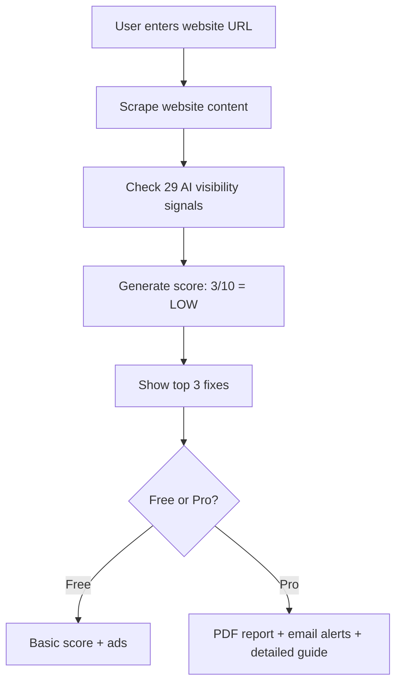

# 🎯 **AI Visibility Checker for Local Businesses - Complete Build Plan**

## **📋 IDEA IN DETAIL**

### **What The Tool Does:**

A local business owner (restaurant, doctor, plumber, shop) enters their website URL → gets an instant report showing **if they appear in AI search results** (ChatGPT, Perplexity, Google AI Overviews) + actionable fixes to improve visibility.

***

### **The Problem (Why This Matters):**

| Statistic | Impact |
|-----------|--------|
| **83% of restaurants invisible in AI recommendations** | Customers can't find them via AI  [einpresswire](https://www.einpresswire.com/article/898357048/ai-search-recommends-only-1-2-of-local-businesses-the-rest-are-invisible) |
| **ChatGPT recommends only 1.2% of local businesses** | 98.8% of businesses are invisible  [einpresswire](https://www.einpresswire.com/article/898357048/ai-search-recommends-only-1-2-of-local-businesses-the-rest-are-invisible) |
| **Only 45% overlap between Google & AI rankings** | Strong Google ranking ≠ visible in AI  [einpresswire](https://www.einpresswire.com/article/898357048/ai-search-recommends-only-1-2-of-local-businesses-the-rest-are-invisible) |
| **AI travel referrals grew 17x in 1 year** | AI search is exploding, can't ignore  [einpresswire](https://www.einpresswire.com/article/898357048/ai-search-recommends-only-1-2-of-local-businesses-the-rest-are-invisible) |
| **AI local visibility is 30x harder than Google ranking** | Need specific optimization  [searchengineland](https://searchengineland.com/ai-local-visibility-report-2026-468085) |

**Real Example:**
```
User asks ChatGPT: "Best Italian restaurant near Central Park"
ChatGPT recommends 3 restaurants:
1. Mario's Pizza (visible in AI)
2. Bella Vista (visible in AI)
3. Tony's Pasta (visible in AI)

Your restaurant: "Giovanni's Kitchen" (ranked #1 on Google Maps)
NOT on ChatGPT's list = losing customers to competitors
```

***

### **How The Tool Works (User Flow):**



### **The 29 Signals Checked:**

```
1. Location Data (address, phone)
2. Nearby Landmark References ("near Central Park")
3. Neighborhood Context ("in Downtown area")
4. FAQ Section (customer questions)
5. Schema Markup (LocalBusiness, GeoCoordinates)
6. Opening Hours
7. Transit Options (subway, bus nearby)
8. Reviews on Website
9. Citations on 3rd-party Sites (Yelp, TripAdvisor)
10. Google Maps Integration
11. Yelp/Facebook Profile Links
12. Specialty Keywords (Italian, vegan, gluten-free)
13. Image Alt Text (descriptive)
14. Mobile-Friendly Design
15. Fast Page Load Speed
16. Blog Content (fresh content)
17. Social Media Links
18. Contact Form
19. Service Area Mentioned
20. Price Range Displayed
21. Menu/Services List
22. Hours of Operation
23. Parking Information
24. Accessibility Info
25. Payment Methods
26. Call-to-Action (CTA)
27. Internal Links
28. External Links (authority)
29. Content Freshness (last updated)
```

***

### **What User Gets (Output Example):**

```
AI VISIBILITY SCORE: 3/10 (LOW)

Your website: restaurant.com

✅ Location Data: Present
❌ Nearby Landmark References: MISSING
❌ Neighborhood Context: MISSING
❌ FAQ Section: MISSING
❌ Schema Markup: MISSING
✅ Opening Hours: Present
❌ Transit Options: MISSING
✅ Reviews: Present on website
❌ Citations on 3rd-party sites: MISSING
... (20 more signals)

━━━━━━━━━━━━━━━━━━━━━━━━━━━━━━━━━━━━━━

FIX THESE 4 ITEMS TO APPEAR IN AI SEARCH:

1. Add "near Central Park" to your description
   Current: "Best Italian restaurant in NYC"
   Better: "Best Italian restaurant near Central Park, NYC"

2. Create FAQ section with dietary options
   Add questions like:
   - "Do you have vegan options?"
   - "Is this restaurant gluten-free friendly?"

3. Add schema markup for specialty
   Add: <meta name="specialty" content="Italian, pasta, pizza">

4. Mention nearby transit in footer
   Add: "Located near 5th Avenue subway station"

━━━━━━━━━━━━━━━━━━━━━━━━━━━━━━━━━━━━━━

Free: Top 3 fixes shown
Pro ($15/mo): Full 29-item checklist + PDF report + monthly tracking
```

***

### **Monetization (Free + Single Plan):**

| Feature | Free | Pro ($15/mo) |
|---------|------|--------------|
| **Checks per month** | 1 | Unlimited |
| **Score breakdown** | Basic (3/10) | Detailed (explains each signal) |
| **Fix checklist** | Top 3 items | All 29 items (prioritized) |
| **PDF report** | ❌ No | ✅ Yes |
| **Email alerts** | ❌ No | ✅ Monthly tracking |
| **Detailed fix guide** | ❌ No | ✅ Step-by-step instructions |
| **Ads visible** | ✅ Yes | ❌ No ads |

***

### **Technical Build Specs:**

```
Frontend: Next.js + Tailwind CSS
Backend: Node.js (on Vercel free tier)
Database: Not needed (no user data stored)
API: No AI needed (just text parsing + string matching)
Hosting: Vercel (free for 10K visitors/month)
Payments: Stripe (or Dodo Payments for global)
Auth: None needed (no user accounts)
```

**Core Logic (Example):**

```javascript
// Check if website has landmark references
function checkLandmarkReferences(websiteContent) {
  const landmarks = ["near", "next to", "by", "close to", "walking distance"];
  const locationWords = ["Central Park", "Times Square", "5th Avenue", "Downtown"];
  
  const hasLandmark = landmarks.some(landmark => 
    locationWords.some(location => websiteContent.includes(`${landmark} ${location}`))
  );
  
  return hasLandmark; // true = ✅, false = ❌
}

// Check if schema markup exists
function checkSchemaMarkup(websiteHTML) {
  const hasSchema = websiteHTML.includes('<script type="application/ld+json">') ||
                    websiteHTML.includes('itemtype="http://schema.org/LocalBusiness"');
  
  return hasSchema; // true = ✅, false = ❌
}
```

**Build Time:** 1 week for MVP, 3–4 weeks for full version

**Monthly Cost:** $5–$10 (Vercel hosting + domain)

***

### **Revenue Projection:**

| Month | Visitors | Free Users | Paid (5%) | Ad Revenue | MRR | Total |
|-------|----------|------------|-----------|------------|-----|-------|
| Month 1 | 1,000 | 100 | 5 | $15–$25 | $75 | $90–$100 |
| Month 3 | 5,000 | 500 | 25 | $75–$125 | $375 | $450–$500 |
| Month 6 | 15,000 | 1,500 | 75 | $225–$375 | $1,125 | $1,350–$1,500 |
| Month 12 | 30,000 | 3,000 | 150 | $450–$750 | $2,250 | $2,700–$3,000 |

**Ad CPM:** $15–$25 (local marketing, restaurant supply, real estate)

***

### **Viral Growth Strategy:**

1. **Business shares PDF with marketing agency**
   → Agency sees tool → tries for own clients
   → 10 more businesses sign up

2. **SEO ranking for "AI search visibility checker"**
   → 18K monthly searches, growing 17x [einpresswire](https://www.einpresswire.com/article/898357048/ai-search-recommends-only-1-2-of-local-businesses-the-rest-are-invisible)
   → Current #1: 301digi (poorly marketed) [301digi](https://301digi.com/free-ai-visibility-checker/)
   → Your advantage: Better UX + weekly tracking

3. **50 Facebook groups (restaurant owners, doctors, shops)**
   → Post: "Free AI Visibility Checker - See if ChatGPT recommends you"
   → 5,000+ members → 10% try = 500 users Week 1